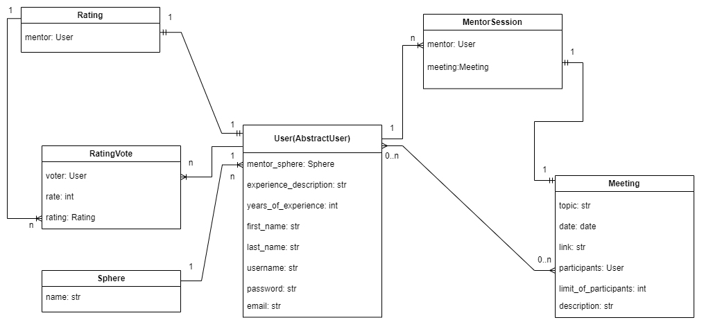
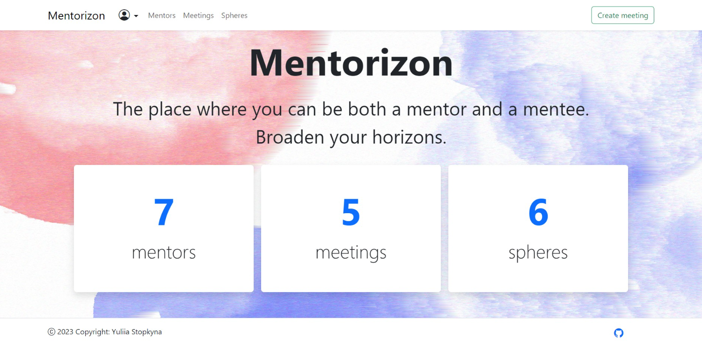

# Mentorizon
It is a service where a user can be both a mentor and a mentee, create meetings, participate in meetings, and rate mentors.

## Link to project

[Mentorizon deployed](https://mentorizon.onrender.com/) on render.com.

## Features

* user can become a mentor when specifies his/her mentor sphere;
* mentors (users with mentor sphere specified) can create, update and delete their meetings;
* user can book existing meetings within the limit of participants of each of the meetings and unbook;
* when the user books a meeting, the meeting link becomes available to the user;
* every mentor has a rating, users can rate mentors but not themselves;
* users can search meetings by topic and filter by mentor sphere;
* users can search mentors by last name and filter by mentor sphere;
* users can search spheres by name.

## DB structure


## Local installation

Python3 must be already installed.

1. Clone project
```shell
git clone https://github.com/yuliia-stopkyna/mentorizon.git
cd mentorizon
```

2. Set virtual environment

(for Windows)
```shell
python -m venv venv 
venv\Scripts\activate
```

(for MacOS)
```shell
python3 -m venv venv
source venv/bin/activate
```
3. Installation
```shell
pip install -r requirements.txt
python manage.py migrate
python manage.py runserver --insecure #starts Django server
# insecure flag to serve static files in DEBUG=False mode
```
## Main page example
